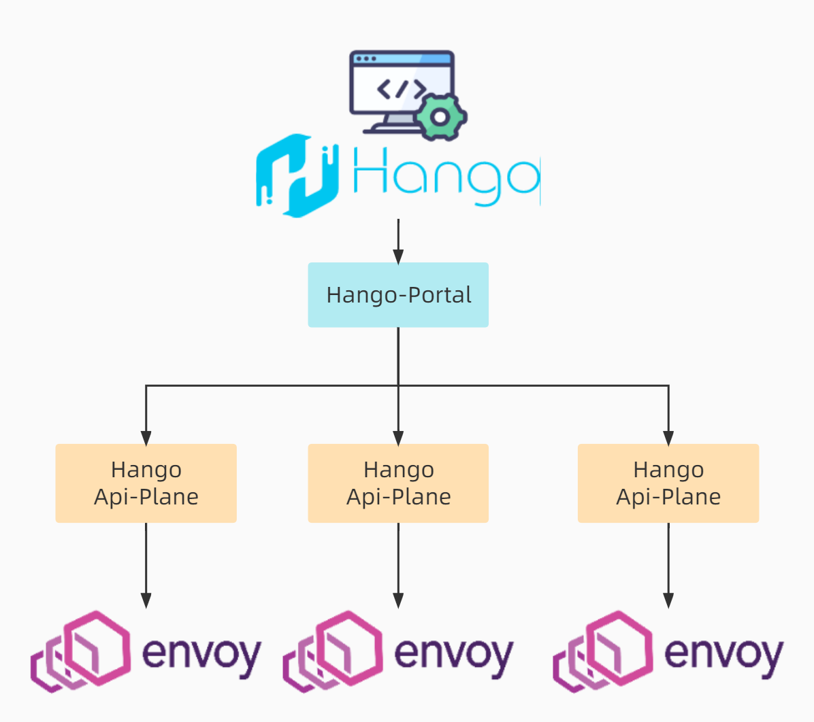

# 快速上手：

## 1.功能模块开关

Hango通过bundle模式Slime开启了插件及限流功能，通过如下命令进行编辑

```shell
kubectl edit cm -n hango-system slime-hango
```

主要配置内容如下

```yaml
data:
  cfg: |
    {"bundle":{"modules":[{"kind":"limiter","name":"limiter"},{"kind":"plugin","name":"plugin"}]},"enable":true,"global":{"configSources":[{"address":"ss://"}],"log":{"logLevel":"info"}},"name":"bundle"}
  cfg_limiter: |
    {"enable":true,"general":{"disableAdaptive":true,"disableGlobalRateLimit":true,"disableInsertGlobalRateLimit":true},"kind":"limiter","mode":"BundleItem","name":"limiter"}
  cfg_plugin: |
    {"enable":true,"kind":"plugin","mode":"BundleItem","name":"plugin"}
kind: ConfigMap
```

`cfg_limiter`和`cfg_plugin`为限流和插件的配置内容，通过修改`cfg`中的`modules`对模块功能进行开关，修改配置并重启Slime组件后开关生效

```shell
## 重启Slime模块命令（k8s删除后会新建Pod）
kubectl delete po -n hango-system {{ Slime Pod名称 }}
```

## 2.插件开关配置

Hango开放`PluginManger`资源开放插件开关，通过如下命令进行编辑

```shell
## 获取PluginManger实例名称
kubectl get pluginmanagers.microservice.slime.io -n hango-system

## 通过上一步骤名称对PluginManger实例进行编辑
kubectl edit pluginmanagers.microservice.slime.io -n hango-system {{ pluginmanager名称 }}
```

主要内容如下（部分内容），插件开关以yaml数组形式展示在PluginManager中，可通过配置对应插件的`enable`字段对插件进行开关，关闭后的插件及时配置路由插件也不会生效； 该配置修改即时生效

```yaml
  - enable: true
    inline:
      settings:
        ip_source_header: x-hango-real-ip
    listenerType: Gateway
    name: proxy.filters.http.iprestriction
    port: 80
  - enable: true
    listenerType: Gateway
    name: proxy.filters.http.locallimit
    port: 80
  - enable: true
    listenerType: Gateway
    name: proxy.filters.http.ua_restriction
    port: 80
```

## 3.网关配置

Hango可对接多集群网关资源，默认创建一个Gateway资源（hango_envoy_gateway）；相同的Hango对接多个Api-Plane以对接多集群的Envoy



网关资源包括如下配置

> 1.网关名称： 用于标识网关的名称
>
>2.网关地址： 用于访问集群中Hango envoy的URI
>
>3.ApiPlane地址： 对接Hango envoy的配置生成模块
>
>4.网关集群名称： 用于标识网关集群的名称
>
>5.域名列表： 访问网关需要携带的域名

### 4.对接数据库

Hango默认安装对接内存数据库H2，可通过更改配置对接其他类型数据库，以下以MySQL为例

依赖：除MySQL数据库外，其他数据库需要在Hango-portal工程中引入驱动依赖，重新打包

#### 4.1.导入数据表依赖

在MySQL客户端中执行[数据表](https://github.com/hango-io/portal/blob/main/gateway-portal/src/main/resources/schema.sql)和[初始数据](https://github.com/hango-io/portal/blob/main/gateway-portal/src/main/resources/data.sql)

#### 4.2.通过如下命令修改hango-portal的ConfigMap

```yaml
kubectl edit cm -n hango-system hango-portal-config
```

#### 4.3.修改如下配置
```yaml
## H2配置
spring.datasource.platform=h2
spring.datasource.url=jdbc:h2:mem:test;DB_CLOSE_DELAY=-1;DB_CLOSE_ON_EXIT=false;MODE=MYSQL;TRACE_LEVEL_FIle=4;TRACE_LEVEL_SYSTEM_OUT=3
spring.datasource.driverClassName=org.h2.Driver
spring.datasource.username=sa
spring.datasource.password=root

## MySQL配置
spring.datasource.driver-class-name=com.mysql.jdbc.Driver
spring.datasource.url=jdbc:mysql://[your mysql uri]/apigw_gportal?&autoReconnect=true&connectTimeout=5000&socketTimeout=50000&generateSimpleParameterMetadata=true
spring.datasource.username=[your username]
spring.datasource.password=[your password]
```

#### 4.4.重启hango-portal

通过如下命令重启hango-portal
```yaml
kubectl delete po -n hango-system [hango-portal Pod名称]
```

#### 4.5.通过脚本创建初始网关

可通过[网关初始化脚本](https://github.com/hango-io/hango-gateway/blob/master/install/init-hango/init.sh)创建初始网关对象；也可通过手动配置[创建网关](#3.网关配置)
