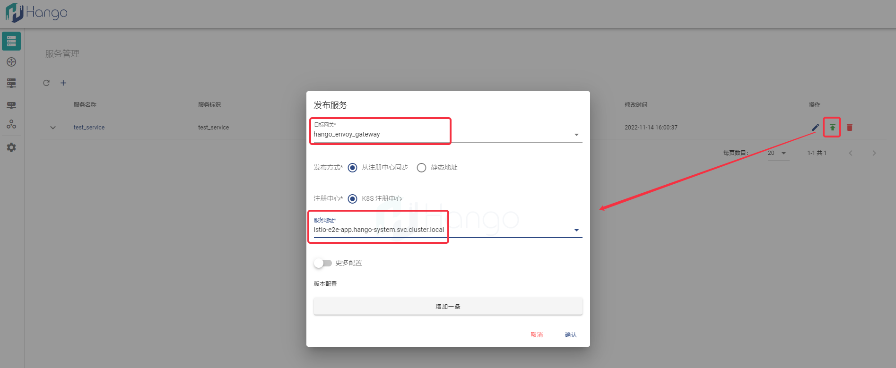
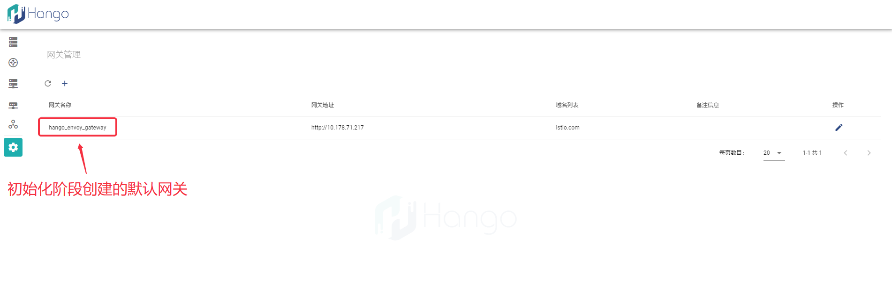

# 快速上手

## 一、界面操作形式

### 1.访问Hango前端界面

Hango默认安装方式下，为hango-ui Pod暴露NodePort类型Service，通过如下命令获取对应端口，您可以通过`服务器IP:NodePort`形式访问Hango界面
```shell
kubectl get svc -n hango-system hango-ui
```
### 2.创建服务

通过`服务管理`界面创建服务元数据，`服务名称`及`服务标识`为必填项


### 2.发布服务

创建服务元数据后，可通过发布按钮将服务发布到指定网关（初始化时创建默认网关）；选择`目标网关`和`服务地址`后可对服务进行发布




### 3.创建路由

通过`路由管理`界面创建路由元数据，填写`所属服务`、`路由名称`和`条件取值`后可创建路由元数据


### 4.发布路由

创建路由元数据后，可通过发布按钮将路由发布到指定网关；过程中可配置路由所属服务的`端口`信息


### 5.确认网关信息

路由发布后可通过Hango网关做请求访问，需要获取路由所发布的网关信息，主要包括`网关地址`和`域名列表`



### 6.访问路由

前提：网关地址已暴露到集群外，否则仅在集群内可访问

获取网关信息后可通过如下命令对网关进行访问

```shell
curl "{{ 网关地址 }}/{{ 路由path }}" -H "{{ 网关域名 }}"
```

## 二、命令行操作形式

### 1.获取hango-portal uri

通过后台命令获取IP及端口组成hango-portal；下文所有命令均基于hango-portal的`http接口`操作
```shell
kubectl get svc -n hango-system hango-portal
```

### 2.创建服务

```shell
curl -XPOST "{{ hango-portal uri }}/gdashboard?Action=CreateService&Version=2018-08-09" \
-H "Content-Type: application/json" \
-d '{
  "ServiceName": "test_service",
  "ServiceType": "http",
  "ServiceTag": "test_service",
  "Description": "",
  "Contacts": "admin"
}'
```

### 2.发布服务
依赖：调用创建服务接口返回`ServiceId`
```shell
curl -XPOST "{{ hango-portal uri }}/gdashboard?Action=PublishService&Version=2019-09-01" \
-H "Content-Type: application/json" \
-d '{
  "GwId": 1,
  "RegistryCenterType": "Kubernetes",
  "PublishType": "DYNAMIC",
  "PublishProtocol": "http",
  "BackendService": "istio-e2e-app.hango-system.svc.cluster.local",
  "TrafficPolicy": {
    "LoadBalancer": {
      "Type": "Simple",
      "Simple": "ROUND_ROBIN",
      "ConsistentHash": {
        "Type": "HttpHeaderName",
        "HttpCookie": {
          "Name": "",
          "TTL": ""
        },
        "HttpHeaderName": "",
        "UseSourceIp": true
      }
    },
    "ConnectionPool": {
      "HTTP": {
        "Http1MaxPendingRequests": "1024",
        "Http2MaxRequests": "1024",
        "MaxRequestsPerConnection": "0",
        "IdleTimeout": "3000"
      },
      "TCP": {
        "MaxConnections": "1024",
        "ConnectTimeout": "60000"
      }
    }
  },
  "ServiceId": 7
}'
```
### 3.创建路由
依赖：调用创建服务接口返回`ServiceId`
```shell
curl -XPOST "{{ hango-portal uri }}/gdashboard?Action=CreateRouteRule&Version=2019-09-01" \
-H "Content-Type: application/json" \
-d '{
  "ServiceId": 7,
  "RouteRuleName": "test_route",
  "Priority": "50",
  "Description": "",
  "Uri": {
    "Type": "exact",
    "Value": [
      "/test_route"
    ]
  }
}'
```
### 4.发布路由
依赖：调用创建服务接口返回`ServiceId`；调用创建路由接口返回`RouteRuleId`
```shell
curl -XPOST "{{ hango-portal uri }}/gdashboard?Action=PublishRouteRule&Version=2019-09-01" \
-H "Content-Type: application/json" \
-d '{
  "GwId": 1,
  "EnableState": "enable",
  "Timeout": "60000",
  "DestinationServices": [
    {
      "BackendService": "istio-e2e-app.hango-system.svc.cluster.local",
      "Port": 80,
      "Weight": 100,
      "ServiceId": 7
    }
  ],
  "HttpRetry": {
    "IsRetry": false,
    "RetryOn": [],
    "Attempts": "2",
    "PerTryTimeout": "60000"
  },
  "ServiceId": 7,
  "RouteRuleId": 5
}'
```

### 5.获取网关信息

通过如下请求获取网关信息，请求主要需要`网关地址`和`网关列表`两个值，其中请求响应中RouteRuleProxyList[].GwAddr为`网关地址`；RouteRuleProxyList[].Hosts为`网关列表`

```shell
curl "{{ hango-portal uri }}/gdashboard?Action=DescribePublishRouteRuleList&Version=2019-09-01"
```

### 6.访问路由

前提：网关地址已暴露到集群外，否则仅在集群内可访问

获取网关信息后可通过如下命令对网关进行访问

```shell
curl "{{ 网关地址 }}/{{ 路由path }}" -H "{{ 网关域名 }}"
```