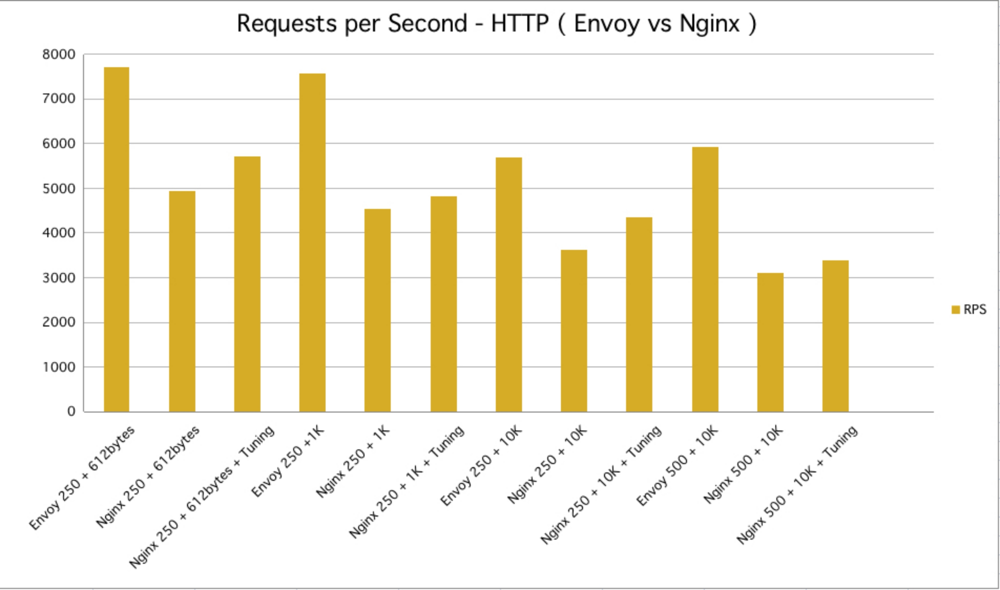

# Hango的诞生背景

> 为什么我们会选择研发Hango，当时的背景和原因是什么？

### 背景

[Hango](https://github.com/hango-io/hango-gateway) 是由网易公司开源的一个基于 **Envoy** 构建的高性能、可扩展、功能丰富的云原生 API 网关。

Hango 提供请求代理、动态路由、负载均衡、限流、熔断、健康检查、安全防护等功能，可用于微服务网关、七层负载均衡、Kubernetes Ingress、Serverless 网关等多种应用场景。此外，通过 Hango 的 Rider 模块，用户可以自定义多语言插件进行能力扩展。

**[Envoy](https://www.envoyproxy.io/)** 是由 Lyft 公司开源的一款高性能代理软件，也是云原生计算基金会（下文简称为 CNCF ）第三个毕业的项目，GitHub目前有17k+ Star（https://github.com/envoyproxy/envoy）。**Envoy 是云原生数据面代理标准软件**。

Envoy 使用 C++ 语言开发，使用全异步事件机制驱动，具备丰富的功能，以及与 Nginx 相当的性能。相比于 Nginx、HAProxy 等经典代理软件，Envoy 还具备强大的可观察性和灵活的可扩展性，并且引入了基于 API 的动态配置方案 xDS。此外，Envoy 还提供了大量的开箱即用的 Filter 以满足各种场景下流量治理的需求。

本文我们将重点探讨 **Hango 为什么会选择 Envoy 作为云原生网关实践的关键基础软件**。

### 起源

我们与 Envoy 结缘来自于服务网格（Service Mesh）相关建设的工作。Envoy 作为服务网格 Istio 的数据面软件选型，承担了东西向、南北向全部数据流量的代理、治理与观测职责。随着服务网格在网易内部大规模落地，我们对 Envoy 的功能、性能、扩展性、可观测性等多方面有了全面的研究与实践，也深刻感受到 Envoy 优质的内在品质，及其在云原生时代巨大的发展潜力。于是我们开始尝试基于 Envoy 建设网易的新一代 API 网关，目标是替换网易内部较多业务采用 Java 异步化网关、 Kong 网关，并能够满足业务逐步进入云原生时代的南北向流量治理需求。从结果上看，选型 Envoy 不仅让我们顺利实现了网易 API 网关全面升级，还推动了网易云原生、微服务技术栈整体的统一与向前发展。

### 背书与潜力

作为 CNCF 第三个毕业的项目，Envoy 是云原生数据面代理软件的事实标准。行业应用方面，Envoy 在谷歌、微软、IBM、亚马逊、F5、雅虎及阿里巴巴、腾讯、百度、华为、网易、美团等国内外诸多大型公司大规模落地应用。Envoy 得到了顶级基金会与龙头公司的双重认可，具备十分优质的行业背书，不仅为其后续的发展提供了非常积极的基础，还展现出在云原生时代成为网络代理引领者的巨大潜力。我们认为 **Envoy 可以作为企业下一代网络代理的重要选型标准**。

（图片数据来自Envoy官网：https://www.envoyproxy.io/）

### 富能力

作为新一代网络代理软件，Envoy 原生具备了非常丰富的特性，能够满足大部分业务场景流量治理的需求：

* **原生功能丰富**：相较于 Nginx、HAProxy 提供流量代理所需的基本功能（更多高级功能通常需要通过扩展插件方式实现或购买商业版），Envoy 本身基于 C++ 已经实现了相当多代理所需高级功能，如高级负载均衡、熔断、限流、故障注入、流量复制等等。更为丰富的功能不仅让 Envoy 天生就可以用于多种场景，原生 C++ 的实现相较于经过扩展的实现方式性能优势更为明显。
* **易观察**：相比于 Nginx、HAProxy 等传统代理软件，Envoy 具备更好的可观察性，包括灵活可定制的日志，丰富的指标监控，原生的多种分布式跟踪协议支持等等。
* **自主可控**：Envoy 的社区完全开放，不存在对应的商业版本，所以不用担心部分高级功能会被锁死在类似开源对应的商业版当中。同时，Envoy 社区非常活跃，在 Envoy 使用过程中的问题或者新的功能需求向社区提出后都可以得到很快的反馈。
* **动态配置**：xDS 协议的提出使得 Envoy 几乎所有的配置都可以动态的下发、加载和生效，而无需重新加载进程。并且 xDS 协议已经成为了构建通用数据面接口协议（UDPA）的基础。
* **易扩展**：Envoy 提供了L4/L7 Filter机制，可以让开发者在不侵入 Envoy 主干的前提下在各个层级对 Envoy 进行扩展和增强。不止于此，Envoy 的 WebAssembly 多语言扩展沙箱，可以支持使用 C++、Golang、JS 等语言扩展能力。
* **多协议**：Envoy 支持代理多种 L7 协议数据，包括 HTTP，Kafka，gRPC，Dubbo，MongoDB 等等。因为 Envoy 所有的协议解析和治理都是使用 Filter 来实现的，此类多协议治理能力其实也是构建在 Envoy 强大可扩展性上的，基本上每一种协议代理能力都对应一个 L4 Filter。

### 高性能

性能对于网络代理软件来说是一个非常重要的指标。Envoy 在原生具备丰富特性的同时，也有着非常优秀、足以媲美 Nginx 与 HAProxy 的性能表现。难能可贵的是，除了基本路由代理功能外，**众多其他功能由于原生 C++ 实现，相较于 Nginx、HAProxy 等通过扩展脚本实现主要功能的方式，性能优势更为明显**。

下面是我们内部环境测试 Envoy 与 Nginx 的基准性能对比数据，仅供参考（均为原生软件，未做任何调优）。

**吞吐量RPS对比**：

**响应时间RT 90值、95值、99值数据对比**：

### 行业趋势

除了具备优质的基因和全面的能力，Envoy 在行业内的发展趋势对企业选型同样十分关键。事实上，Envoy 在不长的发展周期内已经形成了一定的行业趋势。

**行业影响方面**：2020 年 [云原生报告 ](https://www.cncf.io/blog/2021/04/28/cncf-cloud-native-survey-china-2020)显示，Envoy 的行业使用量呈明显上升趋势 —— NGINX （F5）使用量从 54% 减少到 39%，而去年排名第四的 Envoy，超过 F5 和 HAProxy 从15%的份额增长到29%。

**技术趋势方面**：

- **F5** —— Envoy 作为 F5 新一代网络代理软件选型，新研发的 Aspen mesh 使用 Envoy 作为新的代理软件：  https://aspenmesh.io/
- **开源 API 网关** —— 开源项目 Gloo, Contour, Ambassador 均采用 Envoy 作为代理软件
- **云原生基础设施** —— Envoy 是云原生基础设施服务网格 Istio（由 Google、IBM 和 Lyft 联合开发）的核心代理软件，国内阿里巴巴、腾讯、百度、华为、美团、网易等互联网企业均基于此构建大规模分布式微服务体系，并使用 Envoy 作为数据流量代理

**最佳实践方面**：

- **Ebay** —— 使用 Envoy 替换硬件负载均衡，并提供了测试数据：https://envoyconna18.sched.com/event/HDRr/running-envoy-as-an-edge-proxy-bala-madhaven-ebay-qiu-yu-ebay

- **Redit** —— 使用 Envoy 作为其流量代理，并进一步替换 HAProxy 和 AWS ALBs：https://www.infoq.com/news/2019/01/envoy-reddit/

- **Dropbox** —— 从 Nginx 迁移到 Envoy：https://dropbox.tech/infrastructure/how-we-migrated-dropbox-from-nginx-to-envoy

- **阿里巴巴** —— 基于 Envoy 代理软件实现阿里集团云原生基础设施：选自《不一样的双11技术：阿里巴巴经济体云原生实践》一书

- **腾讯** —— 基于 Envoy 代理软件实现腾讯云原生基础设施：https://www.infoq.cn/article/eeggylsq4-ttgc4mklwi

- **美团** —— 基于 Envoy 代理软件实现美团云原生基础设施：https://tech.meituan.com/2019/12/12/meituan-octo.html

### 写在最后

回望 Hango 选型 Envoy 的心路历程，其实也是从传统软件选型到云原生方向演进的思路转变。Hango 作为一名开源领域 “新生” ，会继续站在 Envoy 的肩膀上，以发挥更大的领域价值。也期待更多关注云原生、微服务、API 网关以及 Envoy 的同学加入 Hango 的开源社区建设。