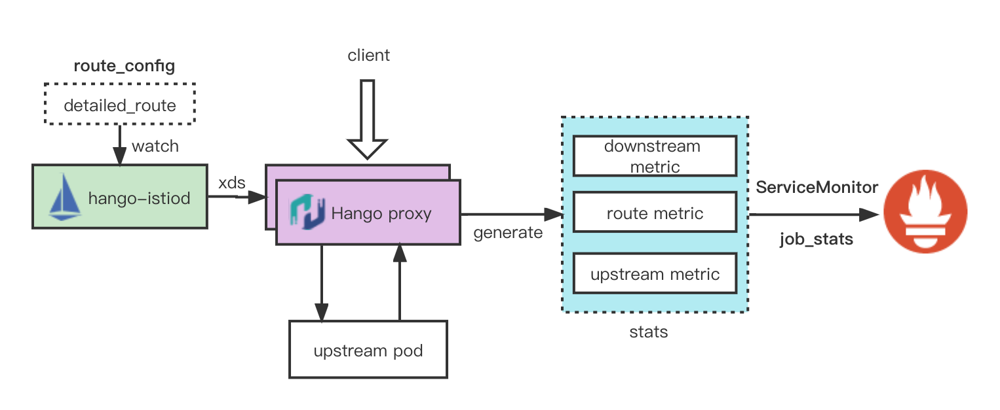

# 指标

Hango 网关暴露丰富的指标项，可以天然的对接prometheus。最佳实践中，我们也是推荐大家可以利用现有的Prometheus采集Hango proxy暴露的指标，达到网关观测的目的。

Hango团队在扩展[envoy基础指标](https://www.envoyproxy.io/docs/envoy/v1.21.5/configuration/upstream/cluster_manager/cluster_stats)基础上上，总结网关实践指标场景，在envoy现有upstream指标的基础上，扩展http_filter，增加proxy.filters.http.detailed_stats filter用于采集路由级别指标，达到在route维度进行指标观测的目的。

## 整体架构

Hango stats的整体架构如下：


Envoy 社区提供了名为 [VirtualCluster](https://www.envoyproxy.io/docs/envoy/v1.21.5/api-v3/config/route/v3/route_components.proto#config-route-v3-virtualcluster) 的特性对请求结果做聚合来实现类似的效果。但是 VirtualCluster 在实现层面是基于而且的请求匹配来实现的，即一个 VirtualCluster 就是一条额外的匹配规则，请求在处理完成后，会遍历匹配所有的 VirtualCluster，命中则增加对应计数。该方法有以下的缺陷：

 * 使用复杂：如果要使用该方法实现路由粒度的指标，必须对每一条路由都创建一条匹配规则完全相同的 VirtualCluster 匹配规则；同时，VirtualCluster 中匹配规则顺序必须和路由匹配顺序保持一致。
 * 性能劣化：为了生成对应的指标，必须要做二次的请求匹配过程。在路由数稍大时，这一部分开销就不可忽略。

所以，VirtualCluster 特定可以适用于一些自定义的指标生成。但是并不适用于明确的路由粒度细粒度指标生成。
此外，在上游方向，除了 Upstream（目标服务维度）指标外，Envoy 本身内嵌了一些 Endpoint 指标，但是不会输出，且只包含 L4 连接相关的指标，达不到实践过程的需求。

因此，Hango团队对envoy指标进行扩展，通过L7 filter扩展自定义指标，通过一个额外的7层扩展来专职实现路由粒度指标。该扩展只需使用metadata来提供额外的配置数据生成路由以及Upstream Host级别的细粒度指标特征。参考：
```
metadata:
  filter_metadata:
    proxy.filters.http.detailed_stats:
      stats:
      - stat_segment_0
      - stat_segment_1
```

Hango已经自动通过路由id以及uri生成对应的detailed_stats。你只需要直接通过路由id获取对应的metric就可以完成指标集成Prometheus。

## 指标项参考

原始指标参考：
| 名称                                 | 类型    | 描述         |
| ------------------------------------ | ------- | ------------ |
| detailed_route.{route_segement_0}.request_total         | Counter | 路由请求总数 |
| detailed_route.{route_segement_0}.request_bytes         | Counter | 路由请求字节 |
| detailed_route.{route_segement_0}.request_bytes         | Counter | 路由响应字节 |
| detailed_route.{route_segement_0}.request_time (bucket) | Counter | 路由耗时     |

为了输出prometheus,需要配置额外的 TagExtractor 来提取其中数据。 Hango已经默认在Hango Proxy config中进行了配置，参考：
```
# For tag from metadata
"^detailed_route(\\.(.*?))\\."
# For response code
"^detailed_route\\..*?\\..*?(\\.(.{3}))"
# For response flag
"^detailed_route\\..*?\\..*?\\..{3}(\\.(.*))"
```

## Grafna面板参考

[Hango Route Stat Grafana](hango_route_stats.json)