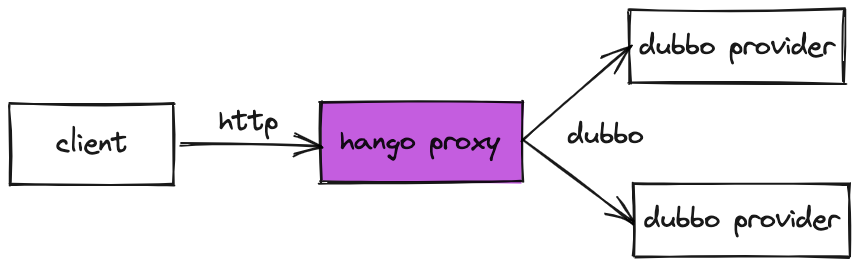
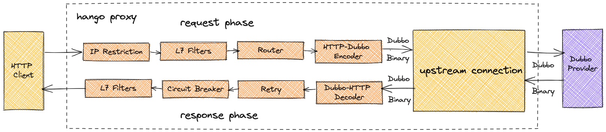

# Dubbo协议转换

> 支持版本: v1.2.0+

Dubbo Bridge提供了HTTP -> Dubbo的能力,入口请求支持http, upstrem为Dubbo 协议的服务。



## 整体架构

Hango通过[slime](https://github.com/slime-io/slime) Mesh-Registry模块对接zookeeper做服务发现。Dubbo provider还是采用原生的Dubbo框架进行注册。Slime将对应的dubbo provider实例封装成ServiceEntry资源，以MCP 协议发送至Istiod。Istid对dubbo cluster进行额外的处理，加入对应的dubbo filter属性，使得Hango proxy能够针对性的以dubbo协议与provide进行通信。


Hango proxy创新性的在7层filter维度实现Dubbo Filter。相比于在4层cluster的实现上，更加的提升了dubbo 转换的性能。在社区原有Dubbo Bridge实现上，所有的转换逻辑都在上游连接中实现，请求输入和响应输出都是HTTP二进制，需要进行额外的二进制编解码操作。Hango扩展实现HTTP Encoder和HTTP Decoder，在Encoder/Decoder模块中完成协议转换，避免不必要的编解码开销。通过实践，Dubbo协议转换性能提升20% - 30%。针对这个点，我们也提交到Envoy社区，一同优化了社区的Dubbo Bridge.



## 使用流程

### 1.配置开关

若不清楚如何安装Hango，请先参考[Hango安装流程指导](https://github.com/hango-io/hango-gateway/blob/master/install/README.zh_CN.md)

当前Hango安装部署阶段决定是否开启zookeeper对接模式，网关请参考需修改[hango-gateway工程](https://github.com/hango-io/hango-gateway)中的安装部署配置来决定是否开启对接

```shell
## 配置文件路径
install/helm/hango-gateway/charts/hango-gateway/values.yaml
```

zookeeper主要的配置内容如下，`enable`字段代表是否开启对接

```yaml
registry:
  zk:
    ## zookeeper注册中心功能开关（true 或 false）
    enable: false
    ## 刷新zookeeper服务缓存的时间周期，默认15s，格式为: [正整数]s
    refresh_period: 15s
    ## 注册中心实例地址；格式：整体以英文单引号包裹，单个地址以英文双引号包裹，多个地址用英文逗号分隔
    address: "zk:2181"
```

### 2.使用指导

Hango界面创建网关选择dubbo类型服务，发布选择zookeeper中的dubbo provider进行暴露。
创建路由并发布后，配置协议转换。

// todo 协议转换详细配置指南
