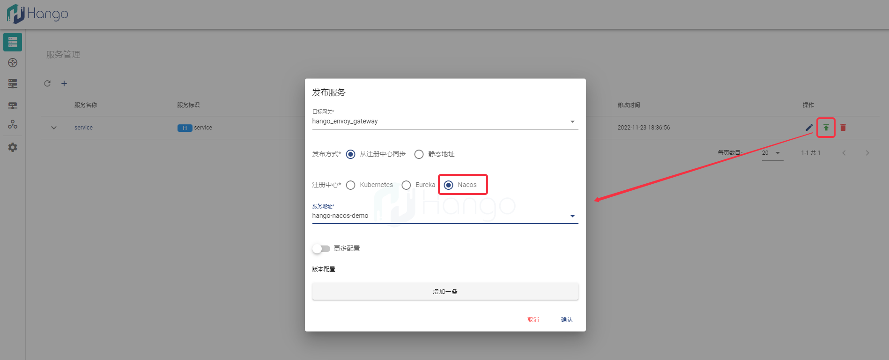

# 对接nacos注册中心

> 支持版本: v1.1.0+

Hango网关支撑对接nacos服务注册中心，通过对接nacos注册中心获取nacos类型服务

## 1.配置开关

若不清楚如何安装Hango，请先参考[Hango安装流程指导](https://github.com/hango-io/hango-gateway/blob/master/install/README.zh_CN.md)

当前Hango安装部署阶段决定是否开启nacos对接模式，网关请参考需修改[hango-gateway工程](https://github.com/hango-io/hango-gateway)中的安装部署配置来决定是否开启对接

```shell
## 配置文件路径
install/helm/hango-gateway/charts/hango-gateway/values.yaml
```

nacos主要的配置内容如下，`enable`字段代表是否开启对接，若声明开启对接nacos则需要填写正确的`address`，否则会导Hango Slime致组件启动异常

注意：当前版本必须指定Nacos注册中的`Group`属性，不然仅从默认组获取服务

```yaml
registry:
  nacos:
    ## nacos注册中心功能开关（true 或 false）
    enable: false
    ## 注册中心实例地址；格式：整体以英文单引号包裹，单个地址以英文双引号包裹，多个地址用英文逗号分隔
    address: '"http://127.0.0.1:8848"'
    ## nacos客户端服务所在分组
    service_group: hango_demo
```

## 2.使用指导

Hango界面中发布服务，若安装部署时打开nacos注册中心功能，则可以看到`Nacos`选项，选择后可查询并发布nacos类型服务到网关，如下图所示



发布服务成功后，创建路由并绑定至该nacos类型已发布服务，则可以通过Hango网关对其进行访问