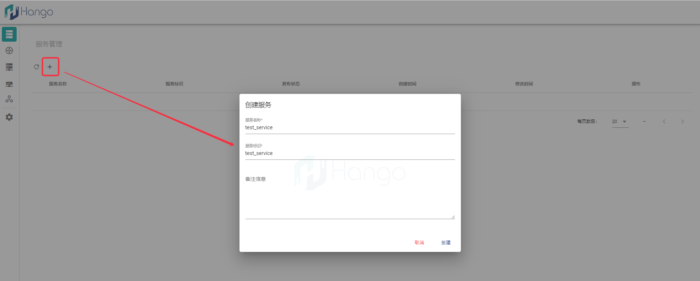
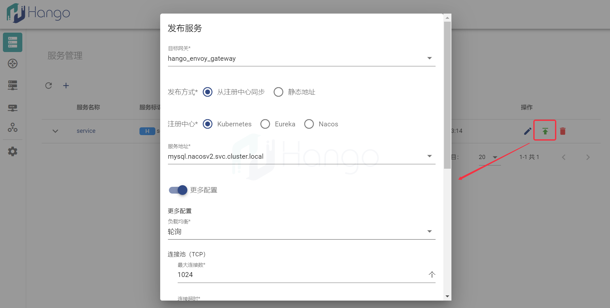
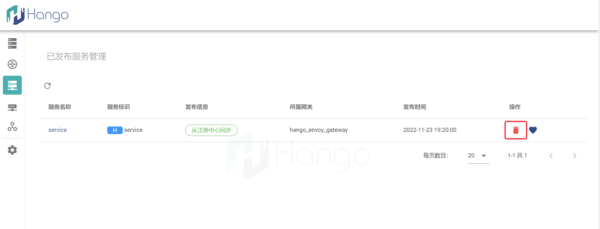
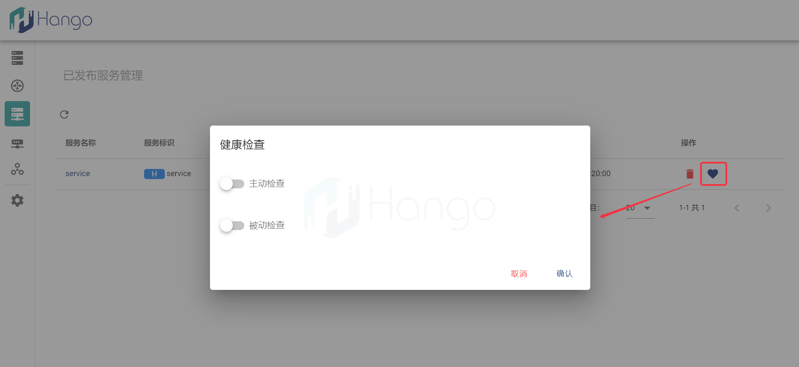

# 服务管理

## 1.服务概念

`服务`是Hango网关的核心概念之一，代表着通过Hango网关的请求将发送至哪个服务，Hango网关的服务也是各种类型服务的总称，包括例如http、dubbo等

Hango网关的服务存在2种形式，如下列表所示

- 服务元数据（服务管理界面）
- 已发布服务（已发布服务管理）

`服务元数据`是携带唯一标识的数据，仅决定服务的协议类型（http、dubbo等），并未配置至Hango数据面（envoy）；

`已发布服务`基于`服务元数据`生成，代表着真正生效的服务内容，其信息包括与环境中服务的映射关系以及更多的高阶配置，包括负载均衡策略、连接池配置等

下线已发布服务不会对服务元数据产生影响，修改服务元数据不会对已发布服务产生影响，这2种形态的服务是解耦的概念

## 2.创建服务

通过`服务管理`界面可以创建服务元数据，以http类型服务为例，通过如下图操作创建服务元数据

## 3.发布服务

基于已经创建好的服务元数据，可以将其发布至指定网关，从而创建对应的已发布服务，如下图所示

可以选择指定的注册中心获取服务，后续该`已发布服务`则是指定服务的映射（即在Hango中就代表着该服务）；打开`更多配置`后可以看到更多属于服务的高阶功能，根据使用的需要进行配置，功能如下列表所示

- 负载均衡
- 连接池
- 版本配置

## 4.下线服务

`已发布服务管理`界面可以对已发布的服务进行下线，点击如下操作按钮即可对服务进行下线

## 5.服务健康检查

已发布服务可以配置主动和被动2种类型的健康检查，以对服务中的实例进行纳管和驱逐，入口如下图所示

- 主动健康检查：对于指定接口和状态码进行定时检查，对于不符合响应码或超时的服务实例进行驱逐

- 被动健康检查：对于500的响应进行判断，驱逐不健康服务实例